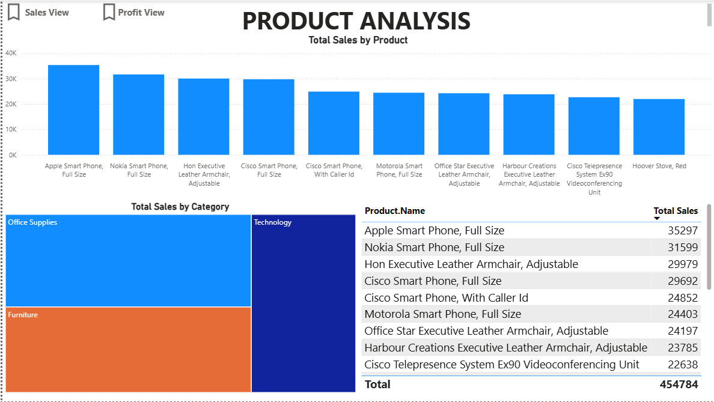
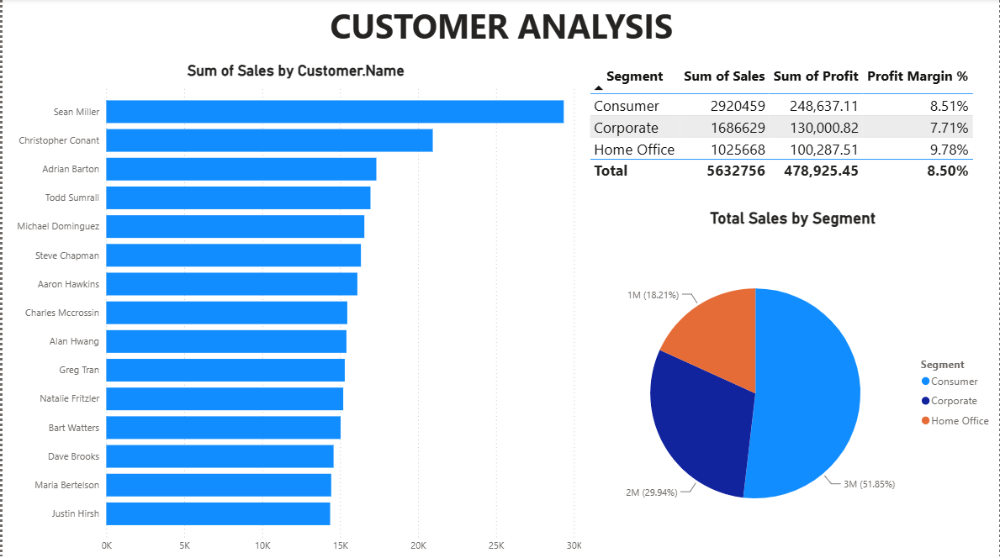
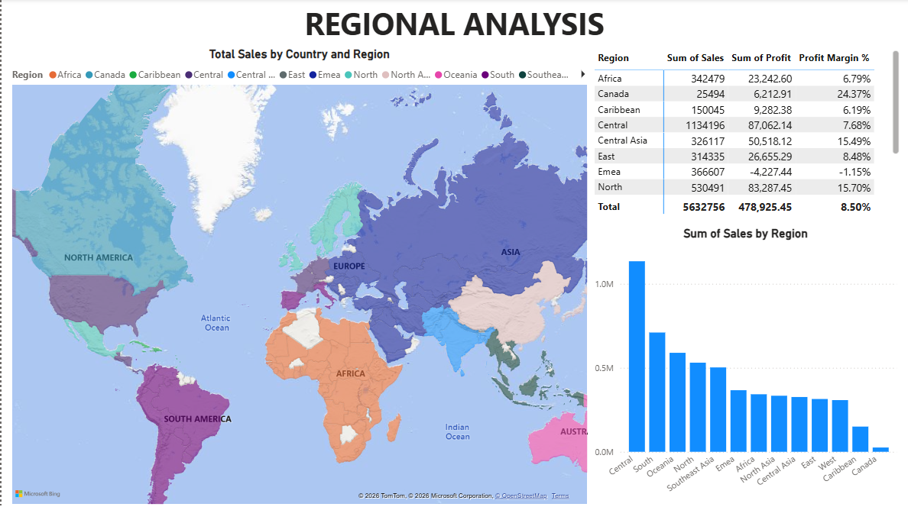
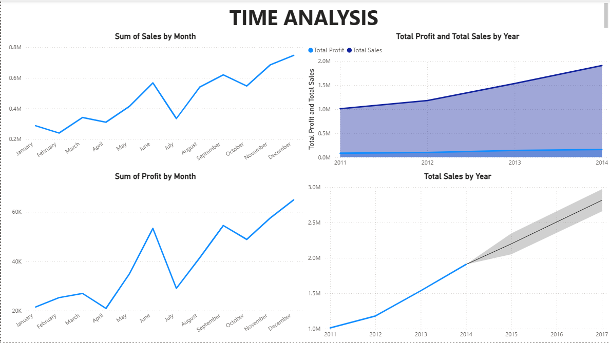

# Superstore-PowerBI-Dashboard
Power BI portfolio project analyzing retail sales performance using Global Superstore dataset.

### 📊 Power BI Report (.PBIX)

The Power BI (.pbix) file contains the full interactive dashboard including:
- Data modeling
- DAX calculations
- Interactive visuals
- Drill-through and filters

Download: [Global Superstore Dashboard](Dataset/Global-Superstore-Dataset.pbix)

### Executive Dashboard

### Product Analysis Total Sales

### Total Sales
!

### Customer Analysis

### Regional Analysis

### Time Analysis

